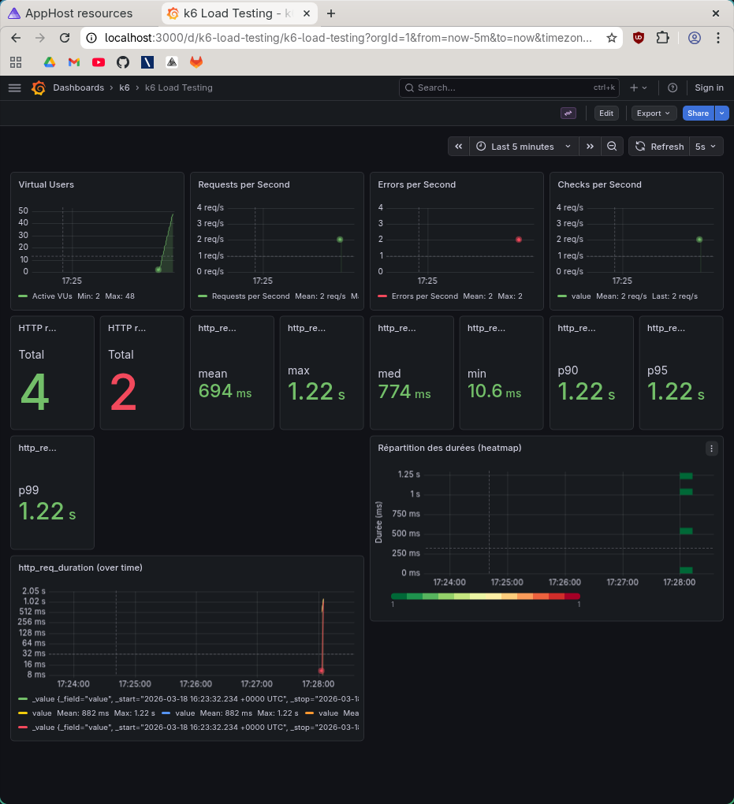

# Rapport — Load test 500k

**Test exécuté** : `task load-500k` (load test, 500 000 films)

## 1. Capture Grafana

_Collez ici une capture d’écran du dashboard Grafana (http://localhost:3000/d/k6-load-testing/k6-load-testing) pendant ou après l’exécution du test._

<!-- Remplacer par votre capture, ex. :  -->

## 2. Observations

Dégradation progressive mais critique : 65 erreurs sur 155 requêtes (42%), latences bimodales entre quelques ms et 31,5 s, montrant une saturation partielle du système.
