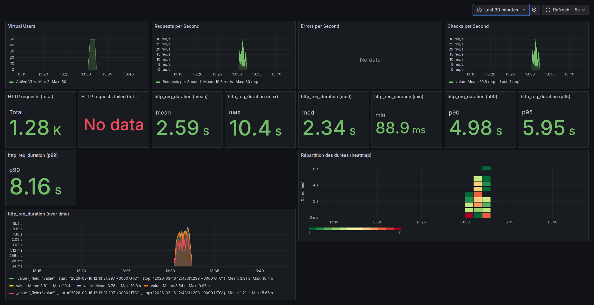
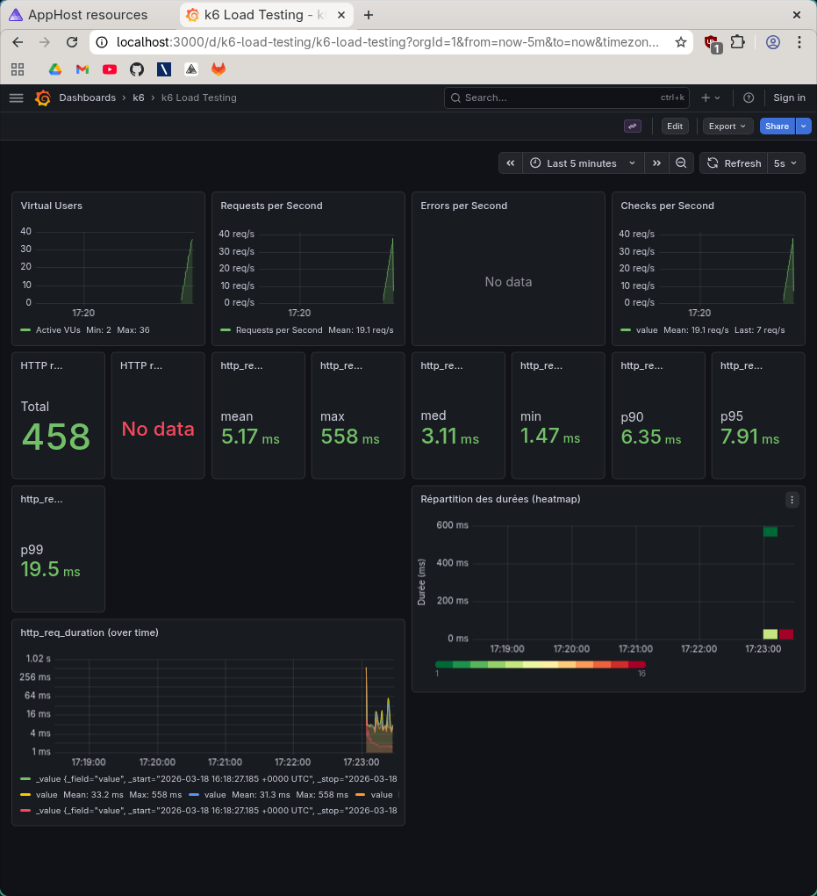

# Rapport — Load test 50k

**Test exécuté** : `task load-50k` (load test, 50 000 films)

## 1. Capture Grafana

_Collez ici une capture d’écran du dashboard Grafana (http://localhost:3000/d/k6-load-testing/k6-load-testing) pendant ou après l’exécution du test._

<!-- Remplacer par votre capture, ex. :  -->

## 2. Observations

- Comportement stable et performant : 36 VUs, 19 req/s, aucune erreur, latences très basses (p99 = 19,5 ms).
