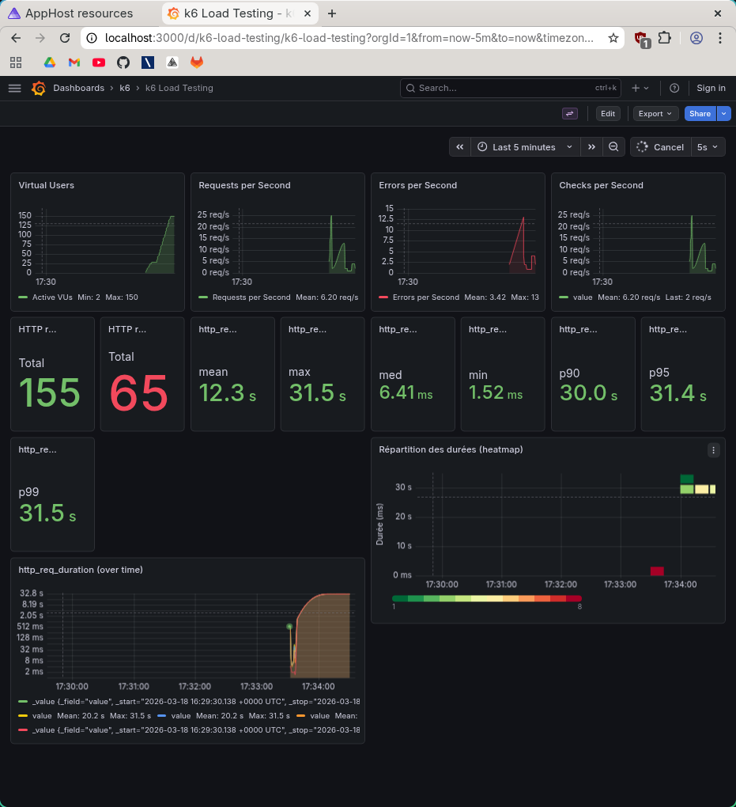

# Rapport — Spike test 500k

**Test exécuté** : `task spike-500k` (spike test, 500 000 films)

## 1. Capture Grafana

_Collez ici une capture d’écran du dashboard Grafana (http://localhost:3000/d/k6-load-testing/k6-load-testing) pendant ou après l’exécution du test._

<!-- Remplacer par votre capture, ex. :  -->

## 2. Observations

Effondrement complet : 137 erreurs sur 137 requêtes (100% d'échec), toutes les latences bloquées à ~30 s (timeout).
