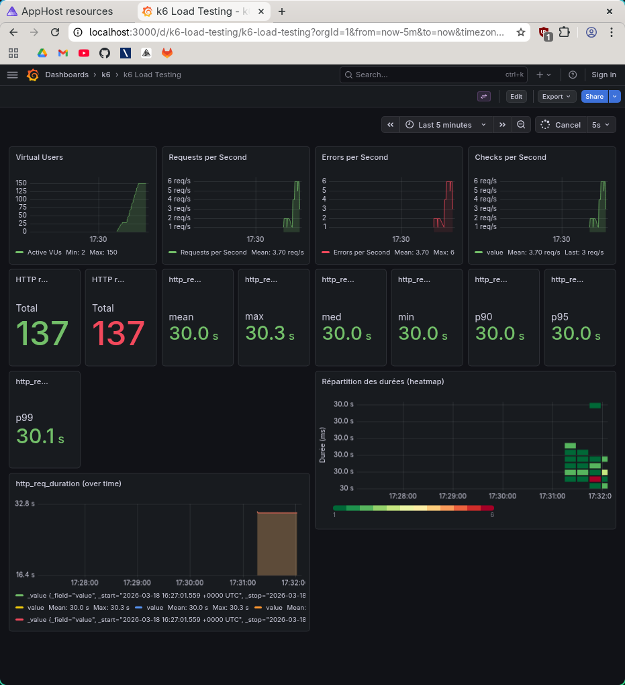

# Rapport — Spike test 50k

**Test exécuté** : `task spike-50k` (spike test, 50 000 films)

## 1. Capture Grafana

_Collez ici une capture d’écran du dashboard Grafana (http://localhost:3000/d/k6-load-testing/k6-load-testing) pendant ou après l’exécution du test._

<!-- Remplacer par votre capture, ex. :  -->

## 2. Observations

_Décrivez ce que vous constatez lors de l’exécution du test (pic de charge, latence, erreurs, dégradation, reprise, etc.)._

- 
- 
- 
